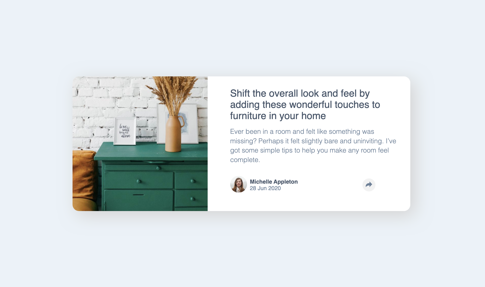

# Frontend Mentor - Article preview component solution

This is a solution to the [Article preview component challenge on Frontend Mentor](https://www.frontendmentor.io/challenges/article-preview-component-dYBN_pYFT). Frontend Mentor challenges help you improve your coding skills by building realistic projects. 

### The challenge

Users should be able to:

- View the optimal layout for the component depending on their device's screen size
- See the social media share links when they click the share icon

### Screenshot

### Links

- Solution URL: https://github.com/maxkaiser100/article-preview.git
- Live Site URL: https://maxkaiser100.github.io/article-preview/

## My process

### Built with

- Semantic HTML5 markup
- CSS custom properties
- Flexbox
- CSS Grid
- Mobile-first workflow
- Javascript

### What I learned

I probably have written some of the worst code in history in this. But - I really wanted to work more with JS even though I basically knew this could almost all be done better with CSS. 

## Author

- Frontend Mentor - [@maxkaiser100]
